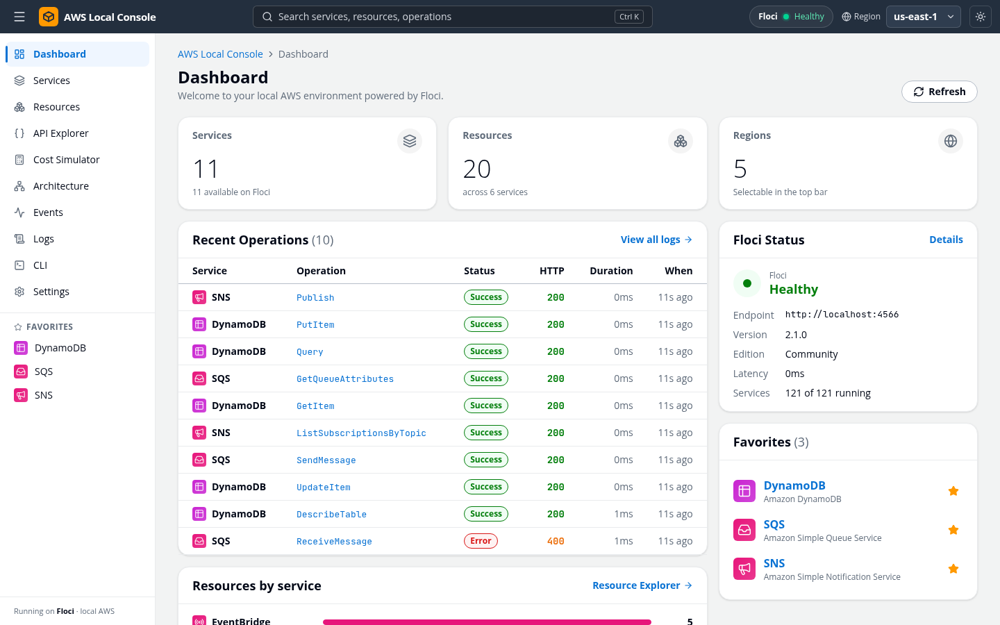
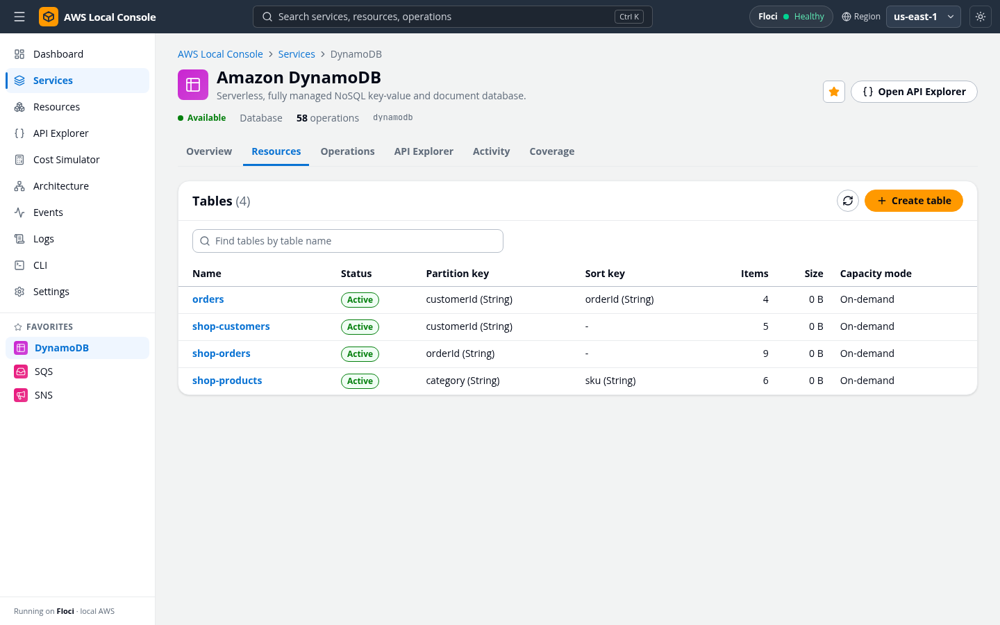
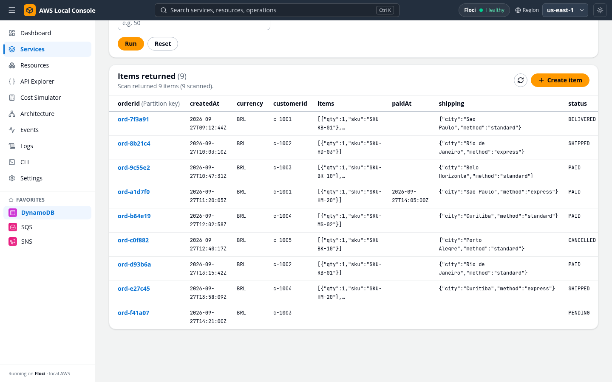
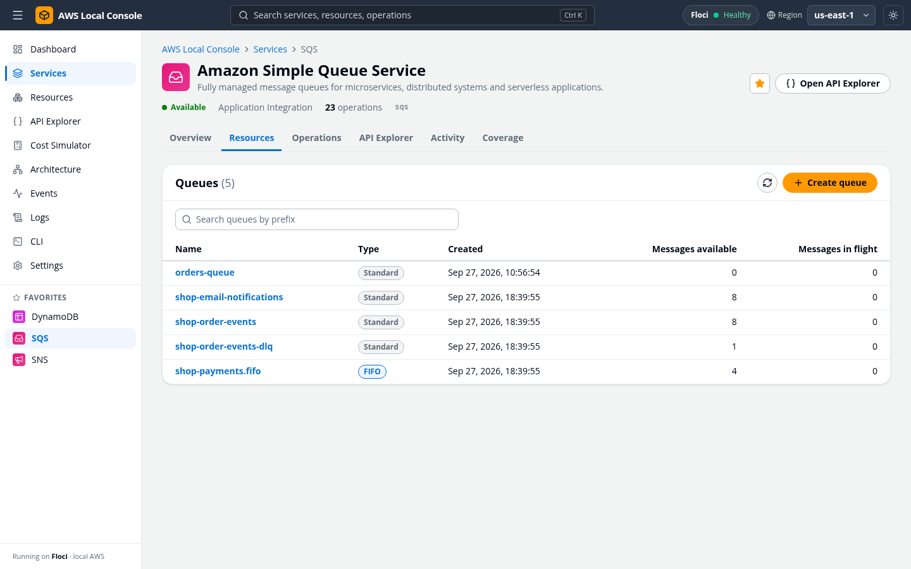
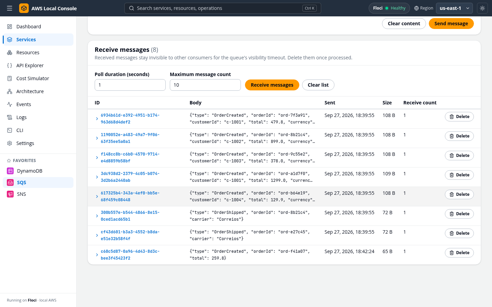
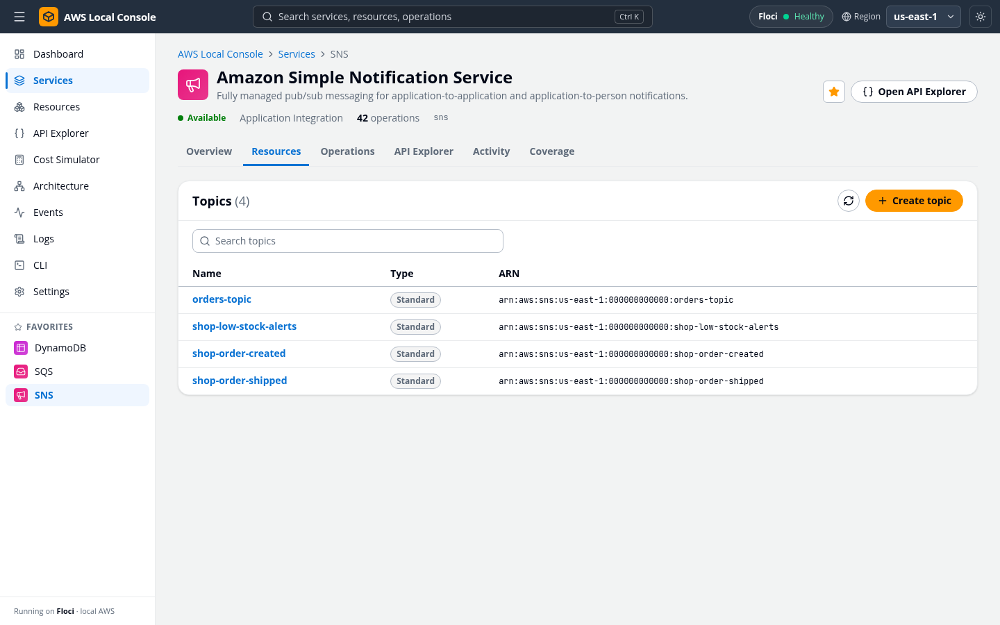
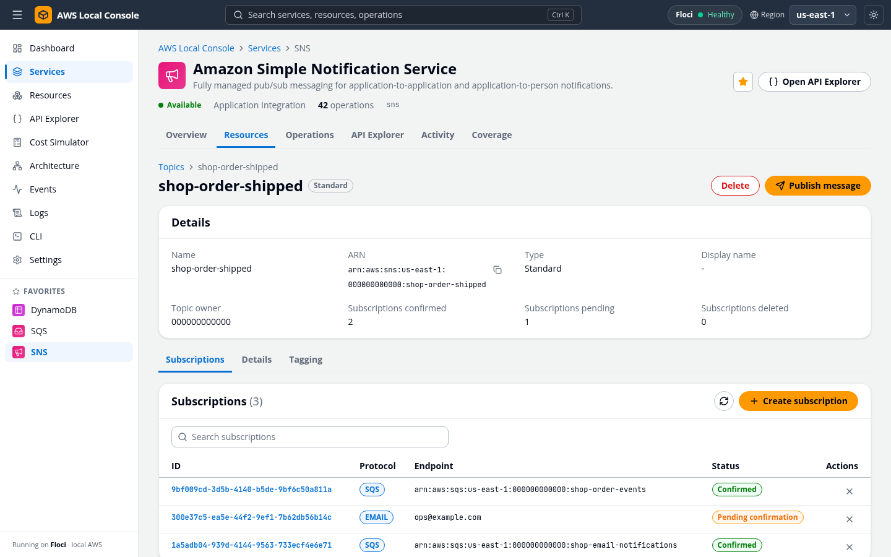
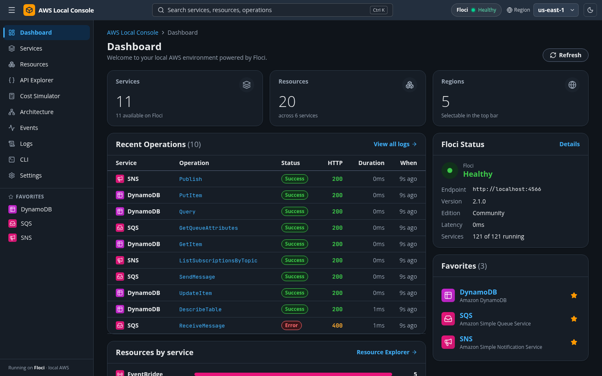

# AWS Local Console

AWS Local Console is a web application to explore and operate AWS services visually, with an interface inspired by the AWS Management Console.
It uses [Floci](https://github.com/floci-io/floci) as the local AWS runtime, so everything runs on your machine without an AWS account.



You can list, create, inspect, edit and delete resources, run arbitrary AWS operations, inspect requests and responses, browse logs and events, and explore relationships between resources.
The console has a light and a dark theme, and by default follows the one of your operating system; pick one from the top bar or in Settings.
The Cost Simulator estimates what the resources of the selected region would cost per month on AWS: it applies public on-demand list prices of US East (N. Virginia) to the resources it finds and to the monthly usage you type for each service.

## Why use it

Local AWS emulators are great for tests, but they have no console: you end up reading JSON from the CLI to find out what a queue holds or which items a table has.
AWS Local Console gives your local environment the console experience you already know from AWS, so you can:

- **See your whole environment at a glance**: services, resources, recent operations and the health of Floci on one dashboard.
- **Develop and debug without an AWS account or bill**: create tables, queues and topics, send test messages and edit items in seconds, all on your machine.
- **Understand what your code does**: every operation is recorded with its request, response, status and duration, whether it came from the console, the API Explorer or the CLI.
- **Explore event-driven flows**: follow a message from an SNS topic to its SQS subscribers, and from a DynamoDB stream to its Lambda trigger.
- **Plan before you deploy**: the Cost Simulator estimates what the same resources would cost per month on AWS.

## A quick tour

### DynamoDB

Browse tables with their keys, item counts and capacity mode, then scan or query items, filter them and edit them in place.

| Tables | Items |
|---|---|
|  |  |

### SQS

List standard and FIFO queues with their message counts, then send, receive and delete messages from the browser.
Dead-letter queues, redrive policies and Lambda triggers are one click away.

| Queues | Messages |
|---|---|
|  |  |

### SNS

Create topics, subscribe queues, Lambda functions, HTTP endpoints or email addresses, see which subscriptions are confirmed and publish messages to test the fan-out.

| Topics | Subscriptions |
|---|---|
|  |  |

### Dark theme



## Run it with Docker

The console is published on Docker Hub as [`edercosta/aws-local-console`](https://hub.docker.com/r/edercosta/aws-local-console): one image with the web console and its API, for `linux/amd64` and `linux/arm64`.
It needs [Floci](https://hub.docker.com/r/floci/floci), the local AWS runtime, next to it.
You only need Docker; no checkout, build, Node.js or Go.

### With Docker Compose (recommended)

Download the ready-made [`compose.release.yaml`](compose.release.yaml) and start it:

```bash
curl -fsSLO https://raw.githubusercontent.com/edermanoel94/aws-local-console/main/compose.release.yaml
docker compose -f compose.release.yaml up -d --wait
```

Or put the services in your own `compose.yaml`, for example next to your application:

```yaml
services:
  floci:
    image: floci/floci:2.1.0
    ports:
      - "4566:4566"
    environment:
      FLOCI_STORAGE_MODE: memory # or persistent, to keep resources between restarts
      FLOCI_SERVICES_LAMBDA_DOCKER_NETWORK: aws-local-console
    volumes:
      - floci-data:/app/data
      - /var/run/docker.sock:/var/run/docker.sock # Floci runs Lambda functions as containers
    extra_hosts:
      - "host.docker.internal:host-gateway"

  console:
    image: edercosta/aws-local-console:latest
    ports:
      - "4500:4500"
    environment:
      FLOCI_ENDPOINT: http://floci:4566
    depends_on:
      - floci

volumes:
  floci-data:

networks:
  default:
    name: aws-local-console
```

```bash
docker compose up -d
```

Open http://localhost:4500.
Your code and the AWS CLI talk to Floci at http://localhost:4566 with any credentials, for example `aws --endpoint-url http://localhost:4566 sqs list-queues`.

| Task | Command |
|---|---|
| Stop | `docker compose down` (add `-v` to also delete the Floci data volume) |
| Update to the latest release | `docker compose pull && docker compose up -d` |
| Follow the logs | `docker compose logs -f console` |

### With Docker only

Pull the images, create a network and start Floci and the console on it:

```bash
docker pull floci/floci:2.1.0
docker pull edercosta/aws-local-console:latest

docker network create aws-local-console

docker run -d --name floci --network aws-local-console -p 4566:4566 \
  -e FLOCI_SERVICES_LAMBDA_DOCKER_NETWORK=aws-local-console \
  -v /var/run/docker.sock:/var/run/docker.sock \
  --add-host=host.docker.internal:host-gateway \
  floci/floci:2.1.0

docker run -d --name aws-local-console --network aws-local-console -p 4500:4500 \
  -e FLOCI_ENDPOINT=http://floci:4566 \
  edercosta/aws-local-console:latest
```

Open http://localhost:4500.
To keep resources between restarts, add `-e FLOCI_STORAGE_MODE=persistent -v floci-data:/app/data` to the Floci command.

Already running Floci on your machine? Start only the console and point it at the host:

```bash
docker run -d --name aws-local-console -p 4500:4500 \
  --add-host=host.docker.internal:host-gateway \
  -e FLOCI_ENDPOINT=http://host.docker.internal:4566 \
  edercosta/aws-local-console:latest
```

| Task | Command |
|---|---|
| Stop and remove | `docker rm -f aws-local-console floci && docker network rm aws-local-console` |
| Update to the latest release | `docker pull edercosta/aws-local-console:latest`, then remove the container and run it again |
| Follow the logs | `docker logs -f aws-local-console` |

### Settings

| Variable | Default | Description |
|---|---|---|
| `FLOCI_ENDPOINT` | `http://floci:4566` | Floci URL used by the console |
| `LOG_LEVEL` | `info` | Console API log level: `trace`, `debug`, `info`, `warning` (or `warn`) or `error` |
| `FLOCI_STORAGE_MODE` (Floci) | `memory` | `memory` loses all resources on restart; `persistent` (or `hybrid`) keeps them in `/app/data` |

The console works however it is opened (localhost, 127.0.0.1, a LAN IP, a tunnel or another device), with no extra setup.
Pin a version such as `edercosta/aws-local-console:0.1.4` instead of `latest` for reproducible setups, or use `edge` to follow the `main` branch with the features that are not released yet.
The Docker Hub page text lives in [`docker/README.dockerhub.md`](docker/README.dockerhub.md).

## Requirements

- Docker with Docker Compose v2
- GNU Make
- Node.js 24 with corepack (the pnpm version is pinned in `packageManager`)
- Go (version from `backend/go.mod`) for local API development
- curl (or wget) for the wait script

## Quick start

```bash
make up
```

This builds the console image (Go API + Next.js), starts it with Floci, and waits until both are healthy.
Then open http://localhost:4500.

Other stack commands:

| Command | Description |
|---|---|
| `make up` | Build and start the full stack, then wait for health |
| `make down` | Stop the stack and remove leftover Lambda containers (volumes are kept) |
| `make logs` | Follow the logs of all services |
| `make build` | Build the console image |
| `make wait` | Wait for Floci and the console (web server and API) to answer |
| `make clean` | Remove containers, volumes, Lambda containers and test artifacts |
| `make help` | List all targets |

## Local development workflow

The contract shared by the web app, the API and the tests lives in [docs/CONTRACT.md](docs/CONTRACT.md), and the product specification in [SPEC.md](SPEC.md).
For day-to-day work run Floci in Docker and the API and web app on the host, with hot reload:

```bash
make dev-floci      # Floci only, via docker compose
make dev-backend    # go run ./cmd/api against http://localhost:4566
make dev-frontend   # pnpm dev (Next.js) against http://localhost:8080
```

Run `make dev-backend` and `make dev-frontend` in separate terminals.
Floci health can be checked at http://localhost:4566/_floci/health and the API health at http://localhost:8080/api/v1/health (in Docker, through the console at http://localhost:4500/api/v1/health).

Equivalent manual commands:

```bash
docker compose up -d --wait floci

cd backend
FLOCI_ENDPOINT=http://localhost:4566 AWS_REGION=us-east-1 \
AWS_ACCESS_KEY_ID=test AWS_SECRET_ACCESS_KEY=test \
PORT=8080 CORS_ORIGINS=http://localhost:4500 go run ./cmd/api

cd frontend
pnpm install
API_INTERNAL_URL=http://localhost:8080 pnpm dev
```

If `pnpm` is not on your `PATH`, run `corepack enable pnpm` once, or prefix the commands with `corepack`.

## Testing

The project is validated through end-to-end tests only: Playwright drives a real browser against the real stack (Next.js, Go API and Floci).
There are no unit tests by design.

```bash
make e2e-install   # once: download the Playwright Chromium browser
make e2e           # start the stack, wait for health, run the whole suite
make e2e-ui        # Playwright UI mode against the running stack
make e2e-report    # open the last HTML report
```

`make e2e` sets a unique `TEST_RUN_ID` so every run creates uniquely named resources, and forwards extra Playwright arguments through `ARGS`, for example `make e2e ARGS="tests/e2e/s3 --headed"`.
The HTML report is written to `playwright-report/`, and screenshots, videos and traces of failed tests to `test-results/`.

The same pipeline runs in GitHub Actions ([.github/workflows/e2e.yml](.github/workflows/e2e.yml)), which uploads `playwright-report/` and `test-results/` as artifacts and attaches the Docker Compose logs when a run fails.

## Configuration

Host ports are configurable, which helps when a default port is already taken:

| Variable | Default | Used for |
|---|---|---|
| `FLOCI_PORT` | `4566` | Floci host port |
| `WEB_PORT` | `4500` | Next.js host port |

Pass them to Make or export them before calling Docker Compose:

```bash
make up WEB_PORT=13000
make e2e WEB_PORT=13000
WEB_PORT=13000 docker compose up -d --build --wait
```

Console image environment variables (defaults already suit Compose):

| Variable | Default | Description |
|---|---|---|
| `FLOCI_ENDPOINT` | `http://floci:4566` | Floci endpoint as seen from the container |
| `PORT` | `4500` | Port the web console listens on (the published port) |
| `API_PORT` | `8080` | Internal port of the Go API inside the container (not published) |
| `AWS_REGION`, `AWS_ACCESS_KEY_ID`, `AWS_SECRET_ACCESS_KEY` | `us-east-1`, `test`, `test` | Region and credentials used against Floci |
| `LOG_LEVEL` | `info` | Go API log level (see below) |

Go API environment variables (when running it on the host):

| Variable | Default | Description |
|---|---|---|
| `FLOCI_ENDPOINT` | `http://localhost:4566` | Floci endpoint (`http://floci:4566` inside Compose) |
| `AWS_REGION` | `us-east-1` | Default region |
| `AWS_ACCESS_KEY_ID` | `test` | Credentials accepted by Floci |
| `AWS_SECRET_ACCESS_KEY` | `test` | Credentials accepted by Floci |
| `PORT` | `8080` | Port the API listens on |
| `CORS_ORIGINS` | `http://localhost:4500` | Origins allowed to call the API directly from a browser (not needed by the console) |
| `LOG_LEVEL` | `info` | `trace`, `debug`, `info`, `warning` (or `warn`) or `error`; an unknown value logs a warning and falls back to `info` |

The Go API logs to stdout, one line per record, at five levels:

| Level | What is logged |
|---|---|
| `TRACE` | Every request's query and caller, the AWS wire exchange of each operation (URL, headers with credentials redacted, input and output payloads) and every Floci health check |
| `DEBUG` | Every HTTP request with its status and duration, and each service's resource discovery |
| `INFO` | Startup, successful operations and Floci becoming reachable |
| `WARNING` | Operations rejected by AWS or by input validation, failed resource discovery, Floci becoming unreachable and an unknown `LOG_LEVEL` |
| `ERROR` | Operations that failed because Floci was unreachable or the console failed, panics and HTTP 5xx answers |

Frontend environment variables (when running it on the host):

| Variable | Default | Description |
|---|---|---|
| `API_INTERNAL_URL` | `http://localhost:8080` | Go API URL as seen by the Next.js server, read at runtime (set by the entrypoint in the image) |

Playwright environment variables:

| Variable | Default | Description |
|---|---|---|
| `BASE_URL` | `http://localhost:4500` | Web app URL used by the tests |
| `TEST_RUN_ID` | current time | Suffix that keeps resource names unique per run |
| `E2E_HOST_FROM_FLOCI` | `host.docker.internal` | Host name under which Floci reaches HTTP servers started by the tests (SNS HTTP subscriptions) |

### Floci and Lambda networking

Lambda functions run as sibling Docker containers that Floci starts through the mounted Docker socket.
Compose pins the network name to `aws-local-console` and passes it to Floci with `FLOCI_SERVICES_LAMBDA_DOCKER_NETWORK`, so Lambda containers join the same network as Floci.
Inside a Lambda, `AWS_ENDPOINT_URL` points to `http://localhost.floci.io:4566`, which the Floci embedded DNS resolves to the Floci container.
`FLOCI_HOSTNAME` is intentionally not set, so resource URLs returned by Floci (for example SQS queue URLs) stay usable from the host.
Lambda containers are labelled `floci=true`, and `make down` and `make clean` remove any leftovers.

### SNS HTTP subscriptions to apps on your machine

Both compose files map `host.docker.internal` to the host gateway in the Floci container, so an SNS HTTP or HTTPS subscription can deliver to an app running on the host, for example `http://host.docker.internal:3000/webhook`.
SNS first posts a `SubscriptionConfirmation` message to the endpoint; paste its `Token` or `SubscribeURL` in the subscription page of the SNS console (Confirm subscription) to start receiving notifications.

## Releasing

The image is published to Docker Hub as `edercosta/aws-local-console`, for linux/amd64 and linux/arm64.
The Dockerfile cross-builds on the build machine's native platform, so no emulation (QEMU) is needed for arm64.

[`.github/workflows/publish.yml`](.github/workflows/publish.yml) runs the full E2E suite and only then builds and pushes the image, with SBOM and provenance attestations:

| Event | Tags published |
|---|---|
| Push to `main` | `edge` |
| Push of a tag `v1.2.3` | `1.2.3`, `1.2`, `latest` |
| Pull request | none (E2E only, [`.github/workflows/e2e.yml`](.github/workflows/e2e.yml)) |

`latest` only moves on version tags, so it always points at a release; `edge` follows `main`.
Cutting a release from CI is just:

```bash
git tag v1.2.3
git push origin v1.2.3
```

The workflow needs the repository secrets `DOCKERHUB_USERNAME` and `DOCKERHUB_TOKEN` (a Docker Hub access token, not the password).

From a workstation: after `docker login`, tag the release commit and run `make release`.

```bash
git tag v1.2.3
make release            # or: make release VERSION=1.2.3
```

`make release` builds each platform separately and pushes `<version>-<arch>` tags, then joins them into the multi-arch `<version>` and `latest` tags.
It refuses to run with a dirty working tree or a non-semver version.

## License

[MIT](LICENSE)
